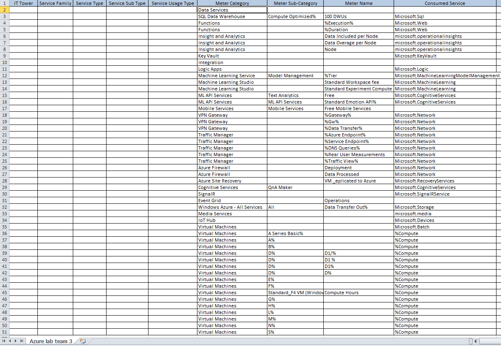

# Аналитическая лабораторная работа №2 (Azure)

## Цель работы

Знакомство с облачными сервисами. Понимание уровней абстракции над инфраструктурой в облаке. Формирование понимания типов потребления сервисов в сервисной-модели. Сопоставление сервисов между разными провайдерами. Оценка возможностей миграции на отечественные сервисы.

## Дано

1. Слепок данных биллинга от провайдера после небольшой обработки в виде SQL-параметров. Символ % в начале/конце означает, что перед/после него может стоять любой набор символов.
2. Google с документациями провайдера

## Описание сервисов Microsoft Azure

## Маппинг Azure сервисов на российские аналоги

## Вывод

