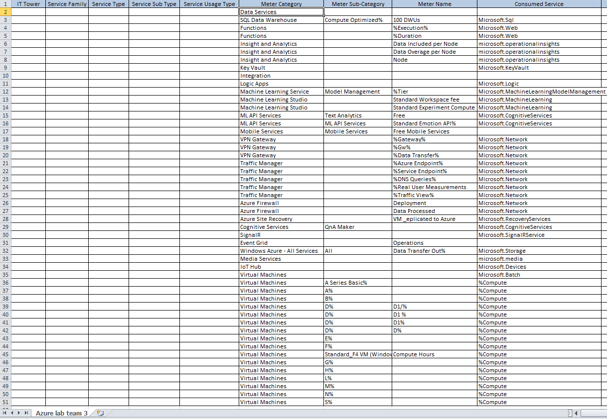
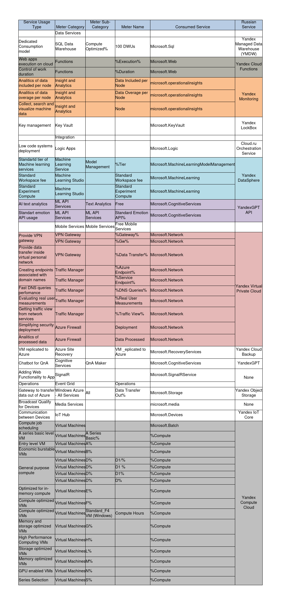

# Аналитическая лабораторная работа №2 (Azure). Вариант 3

Cостав команды **3 кота**: 
+ **Бабаев Руслан**
+ **Абоимов Артём**
+ **Акулов Даниил**

## Цель работы

Знакомство с облачными сервисами. Понимание уровней абстракции над инфраструктурой в облаке. Формирование понимания типов потребления сервисов в сервисной-модели. Сопоставление сервисов между разными провайдерами. Оценка возможностей миграции на отечественные сервисы.

## Дано

1. Слепок данных биллинга от провайдера после небольшой обработки в виде SQL-параметров. Символ % в начале/конце означает, что перед/после него может стоять любой набор символов.
2. Google с документациями провайдера

## Описание сервисов Microsoft Azure

+ **Azure SQL Data Warehouse** с оптимизацией вычислений и 100 Data Warehouse Units (DWUs) представляет собой высокопроизводительное облачное хранилище данных, cпроектированное для аналитической обработки информации. Данные параметры (compute optimizated, 100 DWUs) означают, что ресурсы выделены для обеспечения высокой производительности запросов и обработки данных. Такой вариант подойдет в тех случаях, когда необходима эффективная обработка аналитических запросов, но ресурсы ограничены.

+ **Azure Functions** позволяет создавать и разворачивать функции, реагирующие на события без необходимости управления инфраструктурой. Сервис основан на событийно-ориентированной архитектуре: функции могут быть запущены в ответ на различные события (например, изменения в данных или появление новых сообщений). Azure Functions автоматически регулирует ресурсы в зависимости от нагрузки, тем самым обеспечивая масштабируемость.

+ **Insight and Analytics** (Azure Monitor и Azure Analytics) позволяет собирать метрики и логи из различных ресурсов, а также использовать инструменты для анализа этих данных, создания дашбордов и обнаружения проблем. Сервис обеспечивает полный контроль и понимание производительности, доступности и состояния приложений в Azure.

+ **Key Vault** предназначен для управления секретами, ключами шифрования и сертификатами в безопасной и централизованной среде. Azure Key Vault обеспечивает безопасное хранение и управление конфиденциальной информацией (например, пароли, ключи API и сертификаты), а также позволяет удобно интегрировать их в облачные приложения и службы.

+ **Logic Apps** предоставляет инструменты для создания автоматизированных бизнес-процессов без написания кода. Сервис предлагает графический интерфейс для легкого создания и настройки интеграционных сценариев, позволяя связывать различные службы и приложения, как внутри облака Azure, так и вне его. Azure Logic Apps поддерживает триггеры, условия, а также обеспечивает мониторинг и отладку для управления выполнением бизнес-процессов.

+ **Azure Machine Learning** предоставляет средства для разработки, обучения и развертывания моделей машинного обучения в облаке Azure. Сервис обеспечивает простоту создания и обучения моделей, а также интеграцию с другими сервисами Azure для полноценной работы с данными и максимальной производительности разрабатываемых моделей.

+ **Azure Cognitive Services** предоставляет разнообразные API и инструменты для внедрения искусственного интеллекта в приложения. Сервис включает в себя множество когнитивных функций, таких как распознавание изображений, анализ текста, обработка речи, машинный перевод и т.д. 

+ **Azure VPN Gateway** предоставляет средства для создания безопасных виртуальных частных сетей между облачной инфраструктурой и внешними сетями. Сервис поддерживает как сайт-к-сайту (Site-to-Site) VPN, так и удаленный доступ (Point-to-Site) VPN, обеспечивая защиту передаваемых данных и установление приватных сетевых соединений.

+ **Azure Traffic Manager** предоставляет механизм управления трафиком для распределения запросов между различными экземплярами приложений или служб в разных регионах. Это позволяет обеспечить высокую доступность и эффективность приложений для конечных пользователей.

+ **Azure Firewall** обеспечивает безопасность сети, предотвращая несанкционированный доступ к ресурсам и контролируя сетевой трафик. Сервис включает в себя функции межсетевого экранирования, фильтрации трафика и поддерживает политики безопасности.

+ **Azure Site Recovery** предназначен для обеспечения планирования непрерывности бизнеса и резервного копирования. Сервис позволяет создавать резервные копии виртуальных машин и приложений, а также разрабатывать планы аварийного восстановления для обеспечения оперативного и безопасного восстановления данных и приложений в случае ЧС.

+ **Azure SignalR Service** предоставляет возможности для работы с реальным временем в веб-приложениях. Сервис использует протокол WebSocket для обеспечения мгновенной двусторонней связи между клиентами и серверами. Azure SignalR упрощает разработку и масштабирование приложений, требующих передачи данных в режиме реального времени: чаты, уведомления и многопользовательские приложения.
  
+ **Storage Data Transfer Out** отвечает за расходы на передачу данных из облачного хранилища во внешние сети. Пользователи могут использовать этот сервис для эффективного управления расходами на сетевой трафик и оптимизации передачи данных внутри и вне облака Azure.

+ **Azure Media Services** предназначен для обработки, стриминга и управления медиаконтентом. Он обеспечивает возможности для кодирования видео, стриминга аудио и видео в реальном времени, а также управления медиаконтентом в облачной среде. Azure Media Services поддерживает различные форматы медиа и обеспечивает высокий уровень масштабируемости для обработки больших объемов контента.

+ **Azure IoT Hub** предназначен для управления и связи с большим количеством устройств в сфере Интернета вещей (IoT). Сервис обеспечивает безопасное и масштабируемое взаимодействие между облачным приложением и подключенными устройствами IoT. Azure IoT Hub поддерживает протоколы связи MQTT, HTTP и AMQP, обеспечивая гибкость и удобство в интеграции разнообразных устройств и сенсоров.

+ **Azure Virtual Machines** предоставляет виртуальные машины с гибкой конфигурацией и высокой производительностью. Пользователи могут развертывать виртуальные машины с различными операционными системами и настраивать их под конкретные требования проекта. Этот сервис обеспечивает возможность масштабирования инфраструктуры и высокую доступность, а также предоставляет различные типы виртуальных машин в зависимости от нагрузок.

## Маппинг Azure сервисов на российские аналоги

Для сопоставления сервисов была составлена таблица со ссылками на документацию отечественных сервисов. 

| **Сервис Azure** | **Российский аналог** | Краткое описание аналога |
| --- | --- | --- |
| Azure SQL Data Warehouse | [Yandex Managed Data Warehouse (YMDW)](https://cloud.yandex.ru/ru/solutions/data-warehouse) | Это хранилище, предназначенное для сбора и аналитической обработки исторических данных организации, позволяет объединить данные из различных систем и источников в одном месте, а также улучшить качество данных и скорость доступа к ним. |
| Azure Functions | [Yandex Cloud Functions](https://cloud.yandex.ru/ru/docs/functions/) | Позволяет запускать приложения в безопасном, отказоустойчивом и масштабируемом окружении без создания и обслуживания виртуальных машин. |
| Insight and Analytics | [Yandex Monitoring](https://cloud.yandex.ru/ru/docs/monitoring/) | Позволяет собирать и хранить метрики, а также отображать их в виде графиков на дашбордах. Monitoring автоматически собирает данные о состоянии ресурсов в Yandex Cloud и отображает их на сервисных дашбордах. Для загрузки пользовательских метрик доступен API. |
| Key Vault | [Yandex LockBox](https://cloud.yandex.com/ru/docs/lockbox/) | Позволяет пользователям управлять жизненным циклом секрета — централизовано создавать, изменять и удалять их, а также пользоваться всеми возможностями сервиса [Yandex Identity and Access Management](https://cloud.yandex.ru/ru/docs/iam/) для управления доступом. |
| Logic Apps | [Cloud.ru Orchestration Service](https://cloud.ru/ru/products/application-orchestration-service) | Автоматизирует подготовку облачных ресурсов и развертывание приложений с помощью графического редактора и множества простых шаблонов в формате YAML/JSON. |
| Azure Machine Learning | [Yandex DataSphere](https://cloud.yandex.com/ru/docs/datasphere/) | Позволяет эффективно осуществлять разработку, анализ и внедрение данных и моделей машинного обучения в удобной облачной среде: предоставляется пользовательский интерфейс для работы с данными. |
| Azure Cognitive Services | [YandexGPT API](https://cloud.yandex.com/ru/docs/yandexgpt/) | Предоставляет доступ к нейросети, которая позволяет использовать возможности генеративных языковых моделей в бизнес-приложениях и веб-сервисах. |
| Azure VPN Gateway, Azure Traffic Manager, Azure Firewall | [Yandex Virtual Private Cloud](https://cloud.yandex.com/ru/docs/vpc/) | --- |
| Azure Site Recovery | [Yandex Cloud Backup](https://cloud.yandex.com/ru/docs/backup/) | Позволяет управлять облачными сетями и предоставлять облачным ресурсам возможность подключаться к Интернету и друг к другу. Виртуальное частное облако позволяет создавать сети и подсети в зонах доступности облака Яндекса, назначать частные и общедоступные IP-адреса облачным ресурсам, а также предоставляет выделенный компонент DDoS-защиты. |
| Azure SignalR Service | Нет аналога | - |
| Storage | [Yandex Object Storage](https://cloud.yandex.com/en/docs/storage/) | Это универсальное масштабируемое решение для хранения данных, подходящее как для высоконагруженных сервисов, которым требуется надежный и быстрый доступ к данным, так и для проектов с невысокими требованиями к инфраструктуре хранения. |
| Azure Media Services | Нет аналога | - |
| Azure IoT Hub | [Yandex IoT Core](https://cloud.yandex.com/ru/docs/iot-core/) | Это сервис интернета вещей для двустороннего обмена сообщениями между реестрами и устройствами по протоколу MQTT. |
| Azure Virtual Machines | [Yandex Compute Cloud](https://cloud.yandex.com/ru/docs/compute/) | Предоставляет масштабируемые вычислительные мощности для создания виртуальных машин и управления ими. Сервис поддерживает прерываемые виртуальные машины, а также отказоустойчивые группы виртуальных машин.|

Как видно, не для каждого перечисленного выше Azure сервиса был найден российский аналог. Тем не менее можно сделать вывод, что, например, Yandex Cloud предлагает довольно широкий спектр аналогичных сервисов и продуктов, которые могут быть использованы в качестве замены для Azure сервисов.

## Итоговая таблица

Стоит отметить, что для заполнения таблицы и сопоставления сервисов использовался атрибут Service Usage Type (тип использования сервиса с учетом подтипа, определяющий, какой тип запросов может выполнять пользователь с помощью конкретного сервиса). Таким образом, была получена итоговая таблица.

## Вывод

В ходе данной лабораторной работы нам удалось познакомиться с некоторыми облачными сервисами Microsoft Azure. Каждый из этих сервисов получил описание, и для большинства был найден соответствующий российский аналог, за исключением SignalR и Media Services. Таким образом, по заполненной нами итоговой таблице можно сделать вывод, что почти для всех сервисов миграция возможна.

