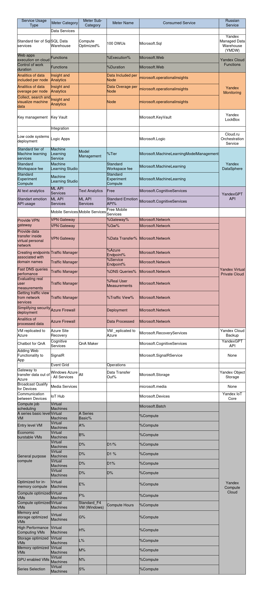

# Аналитическая лабораторная работа №2 (Azure)

## Цель работы

Знакомство с облачными сервисами. Понимание уровней абстракции над инфраструктурой в облаке. Формирование понимания типов потребления сервисов в сервисной-модели. Сопоставление сервисов между разными провайдерами. Оценка возможностей миграции на отечественные сервисы.

## Дано

1. Слепок данных биллинга от провайдера после небольшой обработки в виде SQL-параметров. Символ % в начале/конце означает, что перед/после него может стоять любой набор символов.
2. Google с документациями провайдера

## Описание сервисов Microsoft Azure

**Azure SQL Data Warehouse** с оптимизацией вычислений и 100 Data Warehouse Units (DWUs) представляет собой высокопроизводительное облачное хранилище данных, спроектированное для аналитической обработки информации. Оптимизация вычислений и 100 DWUs указывают на конфигурацию, где ресурсы выделены для обеспечения высокой производительности запросов и обработки данных. Этот вариант подходит для сценариев, где требуется эффективная обработка аналитических запросов при ограниченных ресурсах.

**Azure Functions** – это облачный сервис, который позволяет создавать и разворачивать функции, реагирующие на события без необходимости управления инфраструктурой. Сервис основан на событийно-ориентированной архитектуре, где функции могут быть запущены в ответ на различные события, такие как изменения в данных или появление новых сообщений. Azure Functions обеспечивает масштабируемость, автоматически регулируя ресурсы в зависимости от нагрузки.

**Insight and Analytics** –

**Key Vault** – это облачный сервис, предназначенный для управления секретами, ключами шифрования и сертификатами в безопасной и централизованной среде. Azure Key Vault обеспечивает безопасное хранение и управление конфиденциальной информацией, такой как пароли, ключи API и сертификаты, а также позволяет их удобно интегрировать в облачные приложения и службы.

**Logic Apps** – это облачный сервис, предоставляющий инструменты для создания автоматизированных бизнес-процессов без написания кода. Сервис предлагает графический интерфейс для легкого создания и настройки интеграционных сценариев, позволяя связывать различные службы и приложения, как внутри облака Azure, так и вне его. Azure Logic Apps поддерживает триггеры, условия, а также обеспечивает мониторинг и отладку для управления выполнением бизнес-процессов.

**Azure Machine Learning** – это облачный сервис, предоставляющий средства для разработки, обучения и развертывания моделей машинного обучения в облаке Azure. Сервис обеспечивает простоту создания и обучения моделей, а также интеграцию с другими сервисами Azure для полноценной работы с данными и максимальной производительности разрабатываемых моделей.

**Azure Cognitive Services** - это облачный сервис от Microsoft Azure, предоставляющий разнообразные API и инструменты для внедрения искусственного интеллекта в приложения. Сервис включает в себя множество когнитивных функций, таких как распознавание изображений, анализ текста, обработка речи, машинный перевод и другие возможности машинного обучения. Разработчики могут использовать эти API для придания своим приложениям продвинутых возможностей восприятия и понимания контента.

**Azure VPN Gateway** предоставляет средства для создания безопасных виртуальных частных сетей между облачной инфраструктурой и внешними сетями. Сервис поддерживает как сайт-к-сайту (Site-to-Site) VPN, так и удаленный доступ (Point-to-Site) VPN, обеспечивая защиту передаваемых данных и установление приватных сетевых соединений.

**Azure Traffic Manager** предоставляет механизм управления трафиком для распределения запросов между различными экземплярами приложений или служб в разных регионах. Это позволяет обеспечить высокую доступность и эффективность приложений для конечных пользователей.

**Azure Firewall** предоставляет облачный сервис для обеспечения безопасности сети, предотвращая несанкционированный доступ к ресурсам и контролируя сетевой трафик. Сервис включает в себя функции межсетевого экранирования, фильтрации трафика и поддерживает политики безопасности.

**Azure Site Recovery** – это облачный сервис от Microsoft Azure, предназначенный для обеспечения бизнес-континуитета и резервного копирования. Сервис позволяет создавать резервные копии виртуальных машин и приложений, а также разрабатывать планы аварийного восстановления для обеспечения оперативного и безопасного восстановления данных и приложений в случае чрезвычайных ситуаций.

**Azure SignalR Service** – это облачный сервис от Microsoft Azure, предоставляющий высокоэффективные и масштабируемые возможности для работы с реальным временем в веб-приложениях. Сервис использует протокол WebSocket для обеспечения мгновенной двусторонней связи между клиентами и серверами. Azure SignalR упрощает разработку и масштабирование приложений, требующих передачи данных в режиме реального времени, таких как чаты, уведомления и многопользовательские приложения.

**Azure Event Grid** – это облачный сервис от Microsoft Azure, предоставляющий инфраструктуру для обработки и управления событиями в режиме реального времени. Сервис позволяет создавать и обрабатывать события в различных источниках, таких как приложения, устройства и облачные службы. Azure Event Grid обеспечивает гибкую и масштабируемую архитектуру, позволяя реагировать на события и отправлять их в различные конечные точки для обработки.

**Azure Media Services** – это облачный сервис от Microsoft Azure, предназначенный для обработки, стриминга и управления медиаконтентом. Он обеспечивает возможности для кодирования видео, стриминга аудио и видео в реальном времени, а также управления медиаконтентом в облачной среде. Azure Media Services поддерживает различные форматы медиа и обеспечивает высокий уровень масштабируемости для обработки больших объемов контента.

**Azure IoT Hub** – это облачный сервис от Microsoft Azure, предназначенный для управления и связи с большим количеством устройств в сфере Интернета вещей (IoT). Сервис обеспечивает безопасное и масштабируемое взаимодействие между облачным приложением и подключенными устройствами IoT. Azure IoT Hub поддерживает протоколы связи MQTT, HTTP и AMQP, обеспечивая гибкость и удобство в интеграции разнообразных устройств и сенсоров.

**Azure Virtual Machines** – это сервис в облаке Microsoft Azure, предоставляющий виртуальные машины (VM) с гибкой конфигурацией и высокой производительностью. Пользователи могут развертывать виртуальные машины с различными операционными системами, такими как Windows или Linux, и настраивать их под конкретные требования проекта. Этот сервис обеспечивает возможность масштабирования инфраструктуры, обеспечивает высокую доступность и предоставляет различные типы виртуальных машин для различных нагрузок.

## Маппинг Azure сервисов на российские аналоги

| **Сервис Azure** | **Российский аналог** |
| --- | --- |
| Azure SQL Data Warehouse | [Yandex Managed Data Warehouse (YMDW)](https://cloud.yandex.ru/ru/solutions/data-warehouse) |
| Azure Functions | [Yandex Cloud Functions](https://cloud.yandex.ru/ru/docs/functions/) |
| Insight and Analytics | [Yandex Monitoring](https://cloud.yandex.ru/ru/docs/monitoring/) |
| Key Vault | [Yandex LockBox](https://cloud.yandex.com/ru/docs/lockbox/) |
| Logic Apps | [Cloud.ru Orchestration Service](https://cloud.ru/ru/products/application-orchestration-service) |
| Azure Machine Learning | [Yandex DataSphere](https://cloud.yandex.com/ru/docs/datasphere/) |
| Azure Cognitive Services | [YandexGPT API](https://cloud.yandex.com/ru/docs/yandexgpt/) |
| Azure VPN Gateway, Azure Traffic Manager, Azure Firewall | [Yandex Virtual Private Cloud](https://cloud.yandex.com/ru/docs/vpc/) |
| Azure Site Recovery | [Yandex Cloud Backup](https://cloud.yandex.com/ru/docs/backup/) |
| Azure IoT Hub | [Yandex IoT Core](https://cloud.yandex.com/ru/docs/iot-core/) |
| Azure Virtual Machines | [Yandex Compute Cloud](https://cloud.yandex.com/ru/docs/compute/) |

## Итоговая таблица

## Вывод

В ходе данной лабораторной работы нам удалось познакомиться с некоторыми облачными сервисами Microsoft Azure. Каждый из этих сервисов получил описание, и для большинства был найден соответствующий российский аналог, за исключением Signal и Media Service. Таким образом, по составленной итоговой таблице можно сделать вывод, что почти для всех сервисов миграция возможна.

