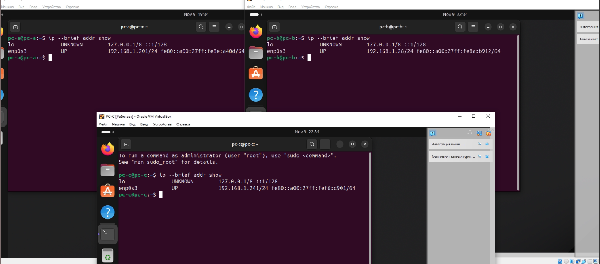
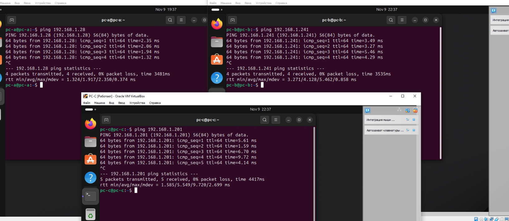
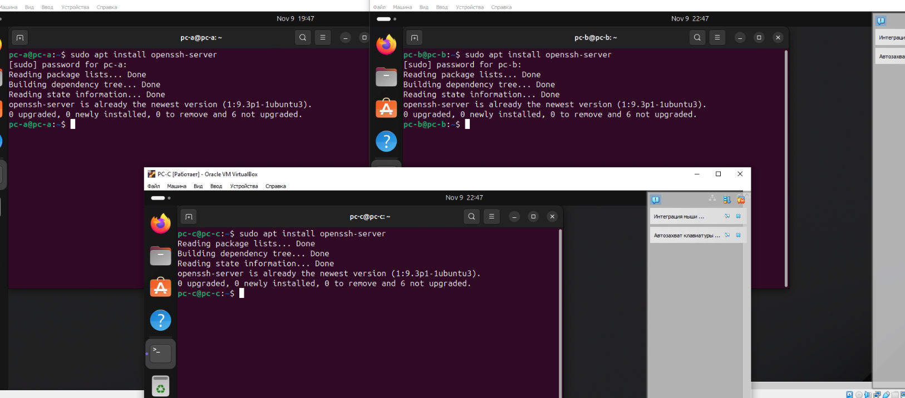
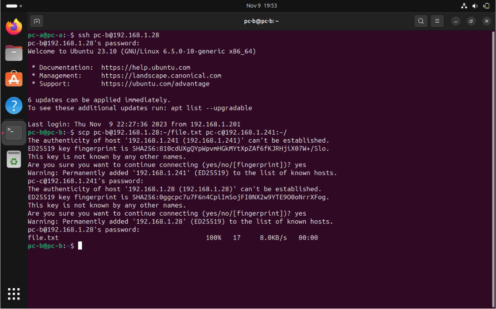
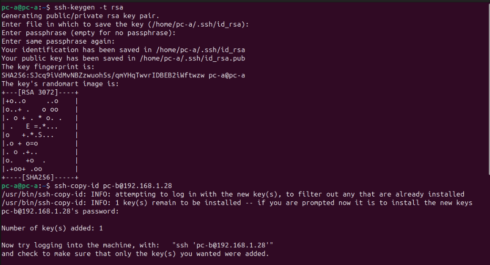
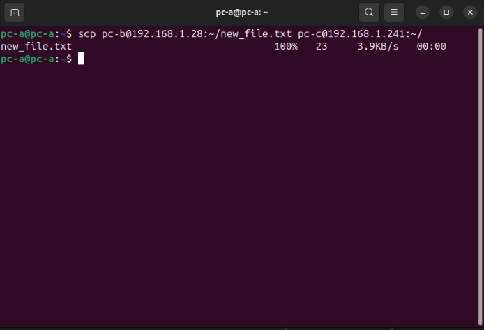

# Лабораторная работа №1

## Задание:
Пользуясь терминалом на компьютере А, перенести файл с компьютера B на компьютер С, находящийся в одной локальной сети.

## Оборудование:
Для выполнения работы необходимо иметь 3 устройства с операционной системой на Linux, в нашем случае это 3 виртуальные машины на Ubuntu, развёрнутые с помощью Oracle VM VirtualBox: **PC-A**, **PC-B**, **PC-C**. Между ними настроен тип связи: сетевой мост – это гарантирует подключение к одной сети.

## Выполнение работы

### Шаг 1. Проверка связи

Для начала стоит достоверно убедиться, что компьютеры находятся в одной локальной сети. Для этого, во-первых, узнаем их ip-адреса:

`$ ip --brief addr show`

А затем пропингуем их:

`$ ping [ip-адрес]`

Таким образом, мы убедились, что компьютеры находятся в одной локальной сети.

### Шаг 2. Настройка SSH

Выполнение лабораторной работы предполагает использование протокола **SSH**. Для его применения необходимо установить пакет **openssh-server**, для этого запускаем следующую команду на компьютерах **PC-B** и **PC-C**:

`$ sudo apt install openssh-server`

Это единственная команда, которую необходимо выполнить на **PC-B** и **PC-C**. Все следующие действие выполняются только на **PC-A**.

### Шаг 3. Получение доступа к PC-B

Подключение к компьютеру **PC-B** производится при помощи команды: 

`$ ssh [имя пользователя]@[ip устройства]`

Далее потребуется ввести пароль указанного пользователя на выбранном устройстве.

### Шаг 4. Переноc файла с PC-B на PC-C

Теперь, после подключения к терминалу **PC-B**, можно перенести файл с этого компьютера на **PC-C** с помощью команды:

`$ scp [путь к файлу на pc-b] [имя пользователя pc-c]@[ip pc-c]:[путь на pc-c]`

Осталось только ввести пароль пользователя **PC-C**.

## Задание со звёздочкой:

Сделать аналогичное, но подключаться при помощи публичных и приватных ключей, а не по логину паролю.

### Шаг 1. Создание и копирование ключа

Для начала нужно создать пару «публичный ключ — приватный ключ». Публичный ключ копируется на компьютер с сервером SSH, то есть на компьютер, к которому будет осуществляться подключение и на котором будут выполнятся команды. Затем подключение выполняется обычным способом, но ввод пароля уже не требуется. Публичный ключ, который копируется на удалённый сервер, не является секретным. Один и тот же ключ можно использовать на разных серверах. Главное — хранить в секрете приватный ключ.

Команда для создания приватного ключа:

`$ ssh-keygen -t rsa`

Команда для копирования ключа:

`$ ssh-copy-id [имя пользователя]@[ip]`

### Шаг 2. Переноc файла с PC-B на PC-C

Нужно создать ключ на **PC-A**, скопировать ключи на машину **PC-B** командой **ssh-copy-id**. Таким же образом необходимо сгенерировать ключи на машине **PC-B** и скопировать на **PC-C**. Далее для переноса файла используем ту же команду, что и в первой части:

`$ scp [путь к файлу на pc-b] [имя пользователя pc-c]@[ip pc-c]:[путь на pc-c]`

Теперь мы можем подключаться к терминалам и передавать файлы по ключу, без ввода пароля!

## Вывод

В данной лабороторной работе с помощью протокола SSH и утилиты scp нам удалось передать файл с устройства Б на устройство С, используя только терминал устройства А, а также настроить подключение по ключам вместо паролей.