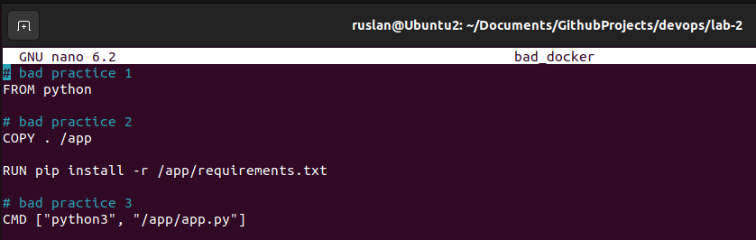

# Лабораторная работа №2

## Задание:
Написать два Dockerfile – плохой и хороший. Плохой должен запускаться и работать корректно, но в нём должно быть не менее 3 “bad practices”. В хорошем Dockerfile они должны быть исправлены. В Readme описать все плохие практики из кода Dockerfile и почему они плохие, как они были исправлены в хорошем  Dockerfile, а также две плохие практики по использованию этого контейнера.

## Выполнение работы

### Шаг 1. Приготовления

В данной работе будем заворачивать в контейнер небольшое flask-приложение, запускающее простую веб-страничку с текстом "I'm alive!". Для начала напишем код такой программы:

Также необходимо создать файл с зависимостями **requirements.txt**. В нем нужно написать всего одну строчку:

`Flask==3.0.0`

На этом в целом наши приготовления окончены. Теперь можно переходить непосредственно к написанию Dockerfile.

### Шаг 2. "Плохой" Dockerfle

Итак, "плохой" Dockerfile будет выглядеть следующим образом:

Разберём нежелательные практики:

1. Плохой практикой является использование **FROM python** в Dockerfile. Это приводит к проблемам совместимости и непредсказуемому поведению приложений. Кроме того, базовый python-образ содержит ненужные зависимости и имеет большой размер, что может замедлить процесс сборки и запуска контейнера.

2. Копирование всего проекта **COPY . /app** до установки всех зависимостей замедлит процесс сборки контейнера. Каждый шаг в Dockerfile создает новый “слой”, который, по сути, представляет собой дифф изменений файловой системы с момента последнего шага. Всякий раз, когда мы изменяем файл в проекте, Docker перестраивает все последующие слои образа, даже если изменения произошли только в одном файле.

3. Использование только CMD (без определения ENTRYPOINT) позволяет легко переопределять исполняемый файл. Так можно добавить желаемую команду в конце строки docker run.

Тем не менее, если мы захотим собрать данный контейнер и потом запустить его, у нас не возникнет никаких проблем. Убедимся в этом.

Сначала соберем образ с помощью команды:

`docker build -t bad-docker .`

И запустим его:

`docker run bad-docker`

А выглядит наша страничка так:

### Шаг 3. "Хороший" Dockerfle

После того как мы разобрали и запустили "плохой" контейнер, можно наконец перейти к "хорошему"! Итак, как он выглядит:

Почему так лучше? 

1. Использование конкретной версии **FROM python:3.10-alpine** позволяет точно определить версию Python и уменьшить размер образа за счет использования минимального базового образа Alpine Linux. Такой подход считается более надежным и эффективным при создании контейнеров.

2. Рекомендуется использовать многоэтапную сборку, когда в первом этапе копируются только необходимые для установки зависимостей файлы COPY ./requirements.txt, а во втором этапе уже копируются файлы приложения COPY . /app. Это позволяет уменьшить размер образа и ускорить процесс сборки.

3. Рекомендуется указывать рабочую директорию с помощью команды **WORKDIR**, чтобы операции внутри контейнера были более предсказуемыми.

4. При использовании **ENTRYPOINT ["python3"]** пользователю достаточно указать только имя файла при запуске контейнера, что более понятно и удобно, а также менее уязвимо.

Best-practices использовали. Теперь соберем образ и запустим контейнер:

Отлично! Всё работает. Для наглядности также сравним вес "хорошего" и "плохого" контейнеров:

Как видим, "плохой" образ весит значительно больше "хорошего", что ещё раз подтверждает эффективность примененных практик.

### Шаг 4. Ещё немного плохих практик при работе с контейнерами

Перечислим также ещё некоторые "плохие" практики:

1. Использование Docker-контейнера для запуска приложения на Flask может быть необоснованным, если приложение не требует масштабирования или изоляции от других приложений, поскольку это может лишь усложнить настройку и поддержку системы.

2. Создание нового образа из изменений в контейнере с помощью команды **docker commit**. Это плохая практика, потому что новый образ не будет включать данные, содержащиеся в смонтированных внутри контейнера томах. Также созданный образ не будет воспроизводим. 

3. Хранение данных в контейнере, поскольку при его уничтожении данные потеряются.

## Вывод

Таким образом, на примере создания Dockerfile для небольшого flask-приложения были изучены некоторые best&bad practices по работе с контейнерами. 

