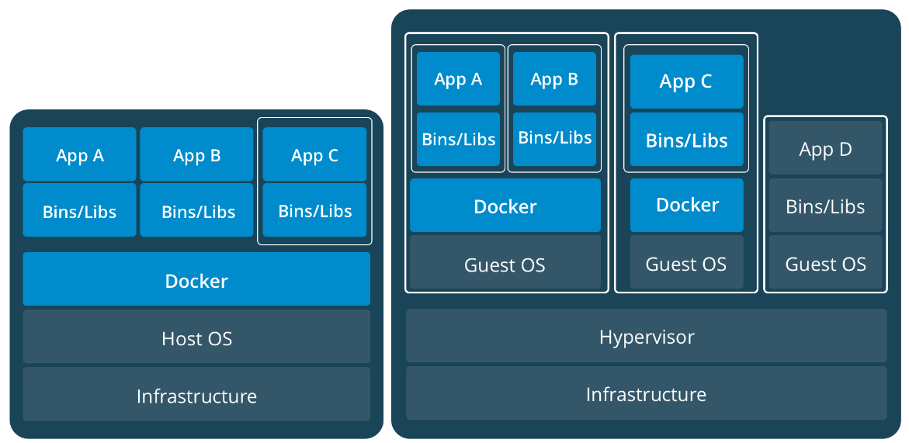

# Теоретические задания

## Задание №1

> Расскажите про контейнерную архитектуру. В чем отличие от обычных компьютеров? В чем преимущества и недостатки над виртуальными машинами? Есть ли задачи, в которых предпочтительнее НЕ использовать контейнеризацию?

Контейнеризация – это упаковка программного кода с библиотеками операционной системы и всеми зависимостями, которые необходимы для выполнения кода. В результате создается единый легкий исполняемый файл, который стабильно работает на любой инфраструктуре, – контейнер.

Отличие контейнерной архитектуры от обычных компьютеров заключается в том, что контейнеры создают изолированные среды для приложений, обеспечивая их независимость и портативность. Каждый контейнер включает в себя свою собственную файловую систему, библиотеки и другие компоненты, что позволяет запускать приложения в изолированных условиях на одном и том же хост-компьютере. В отличие от обычных компьютеров, равно как и от виртуальных машин, вес контейнеров измеряется в мегабайтах. Любой контейнер можно остановить, перезапустить или уничтожить, если это необходимо. При этом один контейнер соответствует одному запущенному процессу.

**Преимущества контейнеров над виртуальными машинами:**

1. **Скорость**. Контейнеры значительно быстрее развертываются, запускаются и останавливаются.

2. **Легковесность и эффективное использование ресурсов**. Контейнеры совместно используют ядро операционной системы машины и не требуют дополнительных расходов на установку ОС в каждое приложение. Это позволяет запускать гораздо больше контейнеров на той же вычислительной мощности, что и одна виртуальная машина. Таким образом, можно повысить эффективность работы серверов и снизить затраты на их лицензирование.

3. **Портативность и согласованность.** Контейнеризация позволяет реализовать принцип **WORA** (англ. written once and run anywhere) — пишите один раз и запускаете где угодно. Такая переносимость ускоряет разработку, предотвращает привязку к поставщикам облачных решений и не только.

4. **Легко автоматизировать развёртывание сервиса**. Контейнеры часто определяются с использованием кода (например, Dockerfile), что позволяет задавать конфигурацию и параметры развертывания в виде кода. Это упрощает автоматизацию создания и конфигурирования контейнеров. В то же время контейнеры интегрируются хорошо с концепцией "инфраструктура как код", позволяя определять и управлять инфраструктурными ресурсами (такими как сети, хранилища и т. д.) через код, и легко интегрируются в процессы непрерывной интеграции (CI) и непрерывной доставки (CD), позволяя автоматизировать тестирование, сборку и развертывание приложений.

**Недостатки контейнеров:**

1. **Меньшая производительность.** Контейнеры имеют ограниченный доступ к ядру операционной системы хоста, в то время как виртуальные машины могут более активно управлять памятью и ресурсами процессора благодаря гипервизору.

2. **Не подходит для устаревших систем.** Если устаревшая система требует специфических версий операционной системы или библиотек, это может создать проблемы совместимости. Кроме того, старые системы могут не иметь необходимой структуры или архитектуры для успешного внедрения контейнеров без крупных изменений в коде или конфигурации.

3. **Неполная изоляция.** Контейнеры предоставляют менее строгую изоляцию по сравнению с виртуальными машинами, поскольку исползуют общие зависимости и общее ядро операционной системы. В случае если атакующий получит доступ к ядру контейнера, это может представлять риск для других контейнеров, работающих на том же хосте.

4. **Зависимость от ОС.** В контейнерной среде используется общее ядро операционной системы, что может быть ограничением для некоторых приложений, требующих специфических версий ядра.

На рисунке представлены наглядные примеры контейнерной архитектуры и виртуализации. Как видно, благодаря гипервизору на одном железе можно поставить несколько гостевых ОС, на каждой из которых в свою очередь может быть реализована контейнерная архитектура. Это означает, что для достижения максимальной эффективности подходы нужно комбинировать, а сами по себе они никак не конкурируют.

Хотя контейнеры обладают множеством преимуществ, существуют задачи, в которых может быть предпочтительнее не использовать контейнеризацию. Например, для приложений, требующих полного виртуализированного окружения с отдельными экземплярами операционных систем, использование виртуальных машин может быть более подходящим вариантом. Кроме того, для некоторых высокопроизводительных вычислений, где требуется полный доступ к ресурсам хост-системы, контейнеры могут оказаться менее эффективными.